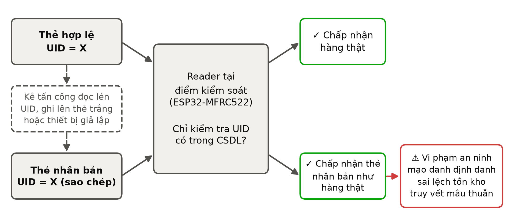

## 2.1. RFID Security and Cloning Attacks

Trong hệ thống RFID, mỗi thẻ mang một số định danh (UID hoặc mã EPC) mà reader đọc qua giao diện vô tuyến, và hệ thống phía sau dùng số này để tra cứu mặt hàng tương ứng. Phần lớn thẻ giá rẻ trong chuỗi cung ứng chỉ thực hiện chức năng nhận dạng (identification): thẻ phát số định danh ở dạng rõ, còn hệ thống chấp nhận số đó mà không yêu cầu thẻ chứng minh mình là thẻ thật, tức không có bước xác thực (authentication) [1], [2]. Về bản chất, các thẻ này chỉ là "mã vạch không dây" [2]. Hệ thống được nghiên cứu cũng có đặc điểm này: firmware của reader ESP32-MFRC522 chỉ ghi nhận UID của thẻ, và mọi quyết định phía sau đều dựa trên UID. Chuỗi rủi ro vì vậy có thể tóm tắt là Thẻ RFID → UID → Nhận dạng thay cho xác thực → Nhân bản → Mạo danh.

Nhân bản thẻ RFID (tag cloning) là việc tạo ra một thiết bị, như thẻ cho phép ghi UID hoặc thiết bị giả lập thẻ, trình diện cùng số định danh và dữ liệu với một thẻ hợp lệ, sao cho reader không phân biệt được hai thiết bị [1], [3]. Với thẻ chỉ có chức năng nhận dạng, kẻ tấn công chỉ cần đọc được UID. Ngay cả thẻ có cơ chế mật mã cũng không an toàn nếu mật mã yếu: với MIFARE Classic, khóa bí mật có thể được khôi phục chỉ từ một hoặc hai lần xác thực với reader hợp lệ, cho phép sao chép toàn bộ thẻ [4]. Khi được hệ thống chấp nhận, thẻ nhân bản mạo danh (impersonate) thẻ thật, và mọi sự kiện nó tạo ra đều được ghi nhận như sự kiện của mặt hàng hợp lệ.

Nhân bản cần được phân biệt với hai dạng tấn công khác cũng có trong bộ dữ liệu RFID-ExSim. Tấn công phát lại (replay) gửi lại các thông điệp đã bị ghi lại từ một phiên liên lạc hợp lệ, nên phụ thuộc vào lưu lượng đã bắt được. Tấn công làm ngập (flooding) tạo ra lượng yêu cầu đọc rất lớn để làm suy giảm khả năng phục vụ của reader, tức nhắm vào tính sẵn sàng thay vì danh tính [3]. Ngược lại, thẻ nhân bản là một bản sao danh tính tồn tại độc lập, có thể trả lời bất kỳ reader nào vào bất kỳ lúc nào, trong khi thẻ thật vẫn tiếp tục hoạt động. Việc hai thiết bị cùng mang một danh tính tạo ra các sự kiện hiếm hoặc bất thường trong luồng dữ liệu RFID, chẳng hạn một UID được ghi nhận ở hai nơi gần như cùng lúc, và đây là cơ sở của các phương pháp phát hiện nhân bản dựa trên dữ liệu [5], [6]. Trong RFID-ExSim, ba dạng tấn công lần lượt tương ứng với kịch bản S3 (nhân bản), S4 (phát lại, với các sự kiện đọc được chèn vào) và S5 (làm ngập); nghiên cứu này tập trung vào S3.

Trong kho hàng thời trang, bề mặt tấn công (attack surface) của nhân bản gồm bốn thành phần. Thứ nhất là giao diện vô tuyến giữa thẻ và reader, nơi kẻ tấn công có thể đọc lén UID bằng một reader không được phép khi hàng đang nằm trên kệ hoặc trong quá trình vận chuyển. Thứ hai là phần cứng ghi và giả lập, gồm thẻ trắng cho phép ghi UID và thiết bị giả lập thẻ, giúp tạo bản sao với chi phí thấp. Thứ ba là reader và phần mềm trung gian tại điểm kiểm soát, vốn chấp nhận mọi UID có trong cơ sở dữ liệu mà không xác thực. Thứ tư là các vùng mù trong chuỗi cung ứng, nơi thẻ không được đọc, cho phép đưa hàng mang thẻ nhân bản vào hệ thống mà không bị phát hiện [2].

Hậu quả an ninh tác động trực tiếp đến ba tài sản đã nêu ở mục 1.1. Danh tính thẻ (Tag Identity) không còn gắn duy nhất với một mặt hàng. Tính toàn vẹn của tồn kho (Inventory Integrity) bị phá vỡ: hàng giả mang UID của hàng thật có thể được nhập kho như hàng hợp lệ, hoặc hàng thật bị lấy đi trong khi thẻ nhân bản ở lại để che giấu sự mất mát. Độ tin cậy của truy vết (Tracking Reliability) suy giảm vì cùng một định danh tạo ra các chuỗi sự kiện mâu thuẫn nhau. Đối với doanh nghiệp, các hậu quả này dẫn đến tổn thất tài chính và tổn hại uy tín thương hiệu [5], [6]. Hình 1 minh họa cơ chế vi phạm: vì reader chỉ kiểm tra UID, cả thẻ thật lẫn thẻ nhân bản đều được chấp nhận.

Hình 1. Cơ chế vi phạm an ninh do nhân bản UID. Hệ thống chỉ nhận dạng theo UID nên chấp nhận cả thẻ hợp lệ và thẻ nhân bản mang cùng UID = X.

### References

[1] A. Juels, "RFID security and privacy: A research survey," *IEEE Journal on Selected Areas in Communications*, vol. 24, no. 2, pp. 381–394, 2006.

[2] D. Zanetti, S. Capkun, and A. Juels, "Tailing RFID tags for clone detection," in *Proc. Network and Distributed System Security Symposium (NDSS)*, 2013.

[3] A. Mitrokotsa, M. R. Rieback, and A. S. Tanenbaum, "Classifying RFID attacks and defenses," *Information Systems Frontiers*, vol. 12, no. 5, pp. 491–505, 2010, doi: 10.1007/s10796-009-9210-z.

[4] F. D. Garcia, G. de Koning Gans, R. Muijrers, P. van Rossum, R. Verdult, R. Wichers Schreur, and B. Jacobs, "Dismantling MIFARE Classic," in *Computer Security – ESORICS 2008*, LNCS, vol. 5283, pp. 97–114, 2008, doi: 10.1007/978-3-540-88313-5_7.

[5] M. Lehtonen, F. Michahelles, and E. Fleisch, "How to detect cloned tags in a reliable way from incomplete RFID traces," in *Proc. IEEE International Conference on RFID*, 2009, doi: 10.1109/RFID.2009.4911190.

[6] H. Kamaludin, H. Mahdin, and J. H. Abawajy, "Clone tag detection in distributed RFID systems," *PLOS ONE*, vol. 13, no. 3, Art. no. e0193951, 2018, doi: 10.1371/journal.pone.0193951.

---

Hình 1 được sinh bởi `../analysis_4_5/figure_2_1_cloning.py` (PNG 300 dpi và PDF trong `figures/`).
